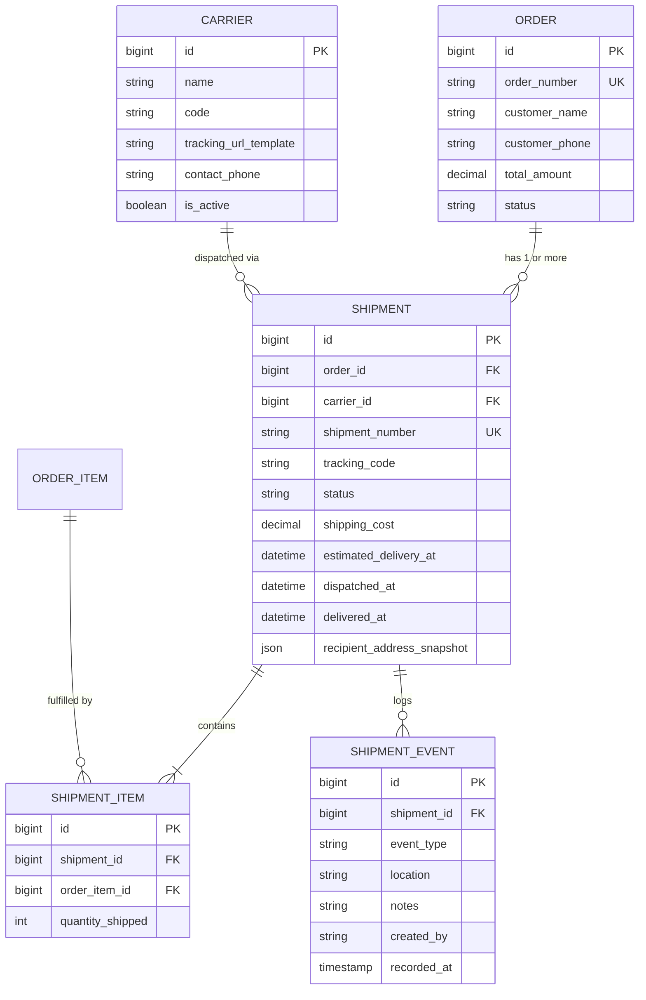

# Shipment Domain Design Specification (Architecture Design Only)

**Phase**: Phase 0 — Production Reality Check  
**Status**: DESIGN SPECIFICATION ONLY (Implementation deferred until core platform stabilization)  

---

## 1. Existing Fulfillment Code Inspection

In the current repository state:
- **Order Model** (`App\Models\Order`): Contains flat fulfillment fields: `shipping_address`, `status` (`pending`, `confirmed`, `processing`, `shipped`, `delivered`, `cancelled`), and financial snapshot totals.
- **OrderItem Model** (`App\Models\OrderItem`): Contains item snapshots (`product_title_snapshot`, `sku_snapshot`, `unit_price_snapshot`, `quantity`, `line_total`).
- **Limitation**: The current system assumes a single monolithic shipment per order. There is no entity model to represent separate packages, multi-warehouse dispatches, partial shipments, courier tracking numbers, or item-level delivery events.

---

## 2. Proposed Domain Entity Models & Schema



---

## 3. Partial Shipment Architecture & Workflow

The shipment domain is explicitly designed to support **Partial Shipments** where items from a single order are fulfilled across multiple dispatches or warehouses:

```
Order (NIES-20260810-AB12)
├── Shipment A (SHP-001 - Dispatched via RedX / Pathao)
│   ├── Item 1: ABC Dry Powder Extinguisher (x2) [Fulfilled]
│   └── Item 2: Smoke Detector (x4) [Fulfilled]
└── Shipment B (SHP-002 - Scheduled Next Week from Central Warehouse)
    └── Item 3: FM-200 Clean Agent System Cylinder (x1) [Processing]
```

### Entity Responsibilities:
1. **`Shipment`**: Represents an individual package/consignment dispatched through a carrier.
2. **`ShipmentItem`**: Pivot record linking an `OrderItem` to a specific `Shipment` with quantity shipped.
3. **`ShipmentEvent`**: Immutable timeline event log (`ready_to_ship`, `picked_up`, `in_transit`, `out_for_delivery`, `delivered`, `delivery_attempt_failed`, `returned`).
4. **`Carrier`**: Courier partner profile (e.g. In-House NIES Logistics, RedX, Pathao, Steadfast, SA Paribahan, Sundarban Courier).
5. **`Tracking`**: Public tracking token and URL generator (`https://niengineeringbd.com/track/{tracking_code}`).

---

## 4. Fulfillment State Machine

```
[ ORDER CONFIRMED ]
       │
       ▼
[ READY FOR PACKAGING ]
       │
       ▼
[ SHIPMENT CREATED (Assigned Carrier & Tracking #) ]
       │
       ▼
[ DISPATCHED / IN TRANSIT ]
       │
       ├─────────────────────────────────┐
       ▼                                 ▼
[ OUT FOR DELIVERY ]             [ DELIVERY FAILED / RESCHEDULED ]
       │                                 │
       ▼                                 ▼
[ DELIVERED & COD COLLECTED ]     [ RETURNED TO WAREHOUSE ]
```

---

## 5. Prerequisites Before Implementing Shipment Domain

Do not implement database migrations or Filament UI for the Shipment domain until the following baseline items are completed and approved:
1. Core single-order checkout and stock decrement verification in production PostgreSQL.
2. Filament Order Resource relation manager established.
3. Courier partner selection (In-house vs third-party API integration) determined.
4. WhatsApp / SMS notification template requirements finalized.
